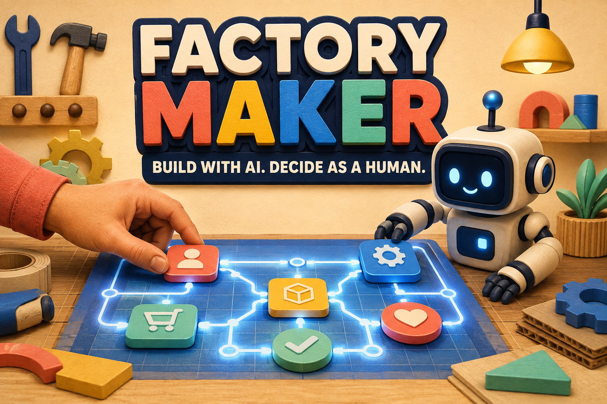

# Factory Maker: Factory Floor



Factory Floor is a shared WebMCP workbench that turns a fuzzy service brief into a working, template-bounded web app. The browser agent structures and builds; the human accepts the brief, chooses the direction, freezes the contract, and keeps release authority. Every mutation is tied to a visible revision and an append-only event ledger.

Built for the [WebMCP Challenge](https://webmcp.devpost.com/).

## Why WebMCP

This is not a chat wrapper or a server-side MCP moved into a page. The application registers narrow tools directly on `document.modelContext`, so the browser agent works with the same state and session the human sees.

The tool inventory changes with the current phase:

| Phase | Agent tools | Human-only action |
| --- | --- | --- |
| Brief | `read_factory_state`, `stage_brief` | Accept the structured brief |
| Concepts | `stage_concepts` | Select one direction |
| Contract | `stage_build_contract` | Freeze the build contract |
| Build | `generate_template_preview` | Keep release authority |
| Evidence | `run_factory_checks`, `read_evidence` | Review or reject the result |
| Generated app | `read_generated_app_state`, `score_project_candidate` | Approve a pilot |

Every write tool requires `expected_revision`. A stale request is rejected without changing state. Tool registrations use an `AbortSignal`, so obsolete phase tools are removed as the workflow advances.

## Three-minute demo path

1. Stage the bundled fuzzy brief.
2. Accept the structured intent card as the human.
3. Generate three concepts and select **Decision Board**.
4. Stage and freeze the bounded build contract.
5. Generate the working micro-app and open it.
6. Score a project candidate, then approve the pilot as the human.
7. Return to Factory Floor and run the evidence gate.

The final screen shows the frozen contract, deterministic output hash, WebMCP registration check, stale-write guard, human-authority evidence, and the shared ledger.

## Run locally

Requirements: Node.js 22.13 or newer.

```bash
npm install
npm run dev
```

Open `http://localhost:3000` in a browser with WebMCP enabled. The interface remains fully usable as a human-only fallback in other browsers.

## Verify

```bash
npm run lint
npm run build
```

The app uses Next.js 16, React 19, TypeScript, Vinext, and the imperative WebMCP API.

## Privacy and responsible use

The prototype has no account system, application database, advertising tracker, or application analytics. Workflow state is stored in the visitor's browser under `factory-floor-state-v1` and can be removed by resetting the demo or clearing the site's browser storage. A compatible browser agent may process state made available through WebMCP when the visitor asks it to act.

- [Terms of Use](https://factory-maker-floor.chalky-wasp-3685.chatgpt.site/terms)
- [Privacy Policy](https://factory-maker-floor.chalky-wasp-3685.chatgpt.site/privacy)
- [AI & Safety Notice](https://factory-maker-floor.chalky-wasp-3685.chatgpt.site/ai-safety)

## License

MIT — see [LICENSE](LICENSE).
